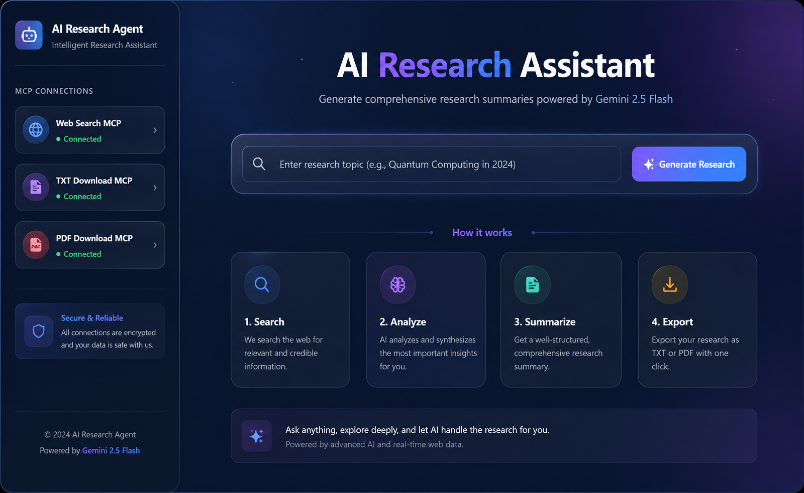

# AI Research Agent: High-Fidelity MCP Assistant

A futuristic, professional-grade research assistant that leverages the **Model Context Protocol (MCP)** to combine real-time web discovery with the reasoning power of **Google Gemini 2.5 Flash**.

 *(UI matches the dark-themed futuristic dashboard)*

## 🚀 Core Capabilities

- **Real-Time Web Discovery:** Uses a dedicated **Web Search MCP** (powered by DuckDuckGo) to fetch "ground truth" context from the live web before synthesizing results.
- **Intelligent Synthesis:** Processes search snippets through Gemini 2.5 Flash to generate comprehensive, structured reports across 7 critical dimensions.
- **Triple-Sync MCP Architecture:** 
    1. **Discovery:** Fetches real-time data via the Search MCP.
    2. **Sync (TXT):** Automatically archives a text-based version of the research.
    3. **Sync (PDF):** Generates a high-quality, formatted PDF for professional use.
- **Futuristic UI:** A sleek, dark-themed dashboard featuring real-time MCP connectivity monitoring, interactive feature cards, and a smooth "Analysis" workflow.

## 🛠 Tech Stack

- **AI Engine:** Google Gemini 2.5 Flash.
- **Search Engine:** Live DuckDuckGo integration (via `ddgs`).
- **Backend:** FastAPI (Python 3.10+).
- **Frontend:** Vanilla JS, CSS3 (Custom Variables/Gradients), FontAwesome, Marked.js.
- **Protocol:** Model Context Protocol (MCP) design patterns.

## 📋 Prerequisites

- **Python 3.10+**
- **Google Gemini API Key** (Get it from [Google AI Studio](https://aistudio.google.com/))

## ⚙️ Setup & Installation

1. **Clone the repository:**
   ```bash
   cd research_agent
   ```

2. **Install dependencies:**
   ```bash
   pip install -r requirements.txt
   ```

3. **Configure the Environment:**
   Create a `.env` file in the root directory:
   ```env
   GEMINI_API_KEY="your_api_key_here"

   # Custom MCP Server Settings (Standard Local Config)
   SEARCH_MCP_URL=http://127.0.0.1:9000
   SEARCH_MCP_TOKEN=my-super-secret-123

   TXT_DOWNLOAD_MCP_URL=http://127.0.0.1:9000
   TXT_DOWNLOAD_MCP_TOKEN=my-super-secret-123

   PDF_DOWNLOAD_MCP_URL=http://127.0.0.1:9000
   PDF_DOWNLOAD_MCP_TOKEN=my-super-secret-123
   ```

## 🏃 Running the Servers

For the full experience (Discovery + Sync), you must run both the core agent and the MCP bridge:

### Terminal 1:
   ### 1. Start the Custom MCP Server
This server handles the live searching and the "cloud" storage simulation.
```bash
python custom_mcp_server.py
```

### Terminal 2:
   ### 2. Start the Research Agent
The main dashboard and orchestration engine.
```bash
python main.py
```

**Visit:** [http://localhost:8000](http://localhost:8000)

## 📁 Project Structure

```text
research_agent/
├── static/                 # Frontend assets (UI & Logic)
│   ├── index.html          # Futuristic dashboard UI
│   ├── style.css           # Custom dark-theme variables & layout
│   └── app.js              # State management & MCP polling
├── agent.py                # Gemini 2.5 Flash integration logic
├── main.py                 # FastAPI core & orchestration layer
├── custom_mcp_server.py    # Local MCP Server (Bridge for Search & Sync)
├── mcp_search.py           # Web Search MCP client (DuckDuckGo)
├── mcp_txt.py              # TXT Sync MCP client
├── mcp_pdf.py              # PDF Sync MCP client
├── exporter.py             # Document generation engine
├── mcp_downloads/          # Local sync storage for reports
├── .env                    # Secrets & Configuration
└── requirements.txt        # Project dependencies
```

- **`main.py`**: The central brain. Orchestrates the flow between Search MCP, Gemini, and Sync MCPs.
- **`custom_mcp_server.py`**: The bridge. Implements the protocol for live search (DuckDuckGo) and file exporting.
- **`agent.py`**: The AI specialist. Handles prompt engineering and Gemini API communication.
- **`mcp_*.py`**: The clients. Dedicated modules for communicating with various MCP nodes.
- **`static/`**: The interface. Futuristic UI built with modern CSS and vanilla JS.
- **`mcp_downloads/`**: The archive. Where your TXT and PDF reports are automatically synced.

## 📄 License
MIT
